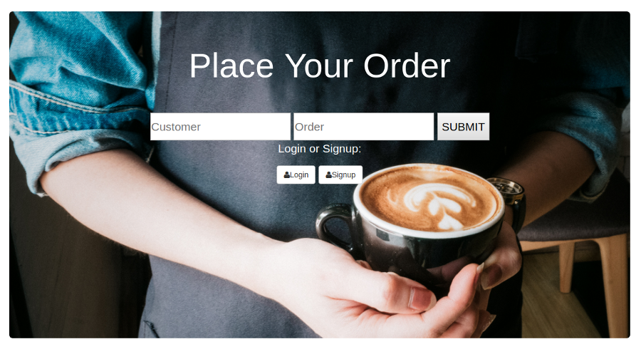
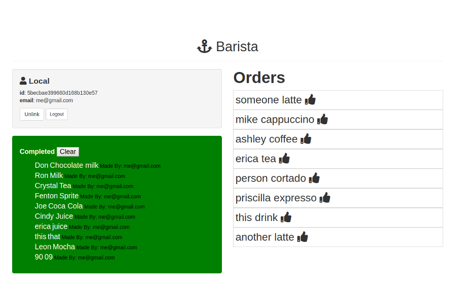

# Fullstack Barista App
An app that enables a cashier to enter a customer's name and their order. Then that order is added to a queue that the baristas can see and give them the ability to mark an order complete. When the order gets marked as complete the app automatically says the customer's name out loud. Also, completed orders show which barista completed the order.

## Homepage

## Barista Profile Page

## How It's Made:

**Tech used:** HTML5, CSS3, JavaScript, Node.js, Mongodb, Express, EJS, Passport. Frontend of the App was created with Embedded Javascript templating for our html content, styled with CSS3, and Interaction created with vanilla JavaScript. The backend of the app was written with node.js using the Express framework to make get, put, post, delete http request. Used MongoDB as my database to keep track of user data. Used Passport to verify and authenticate users of the app.  

## Lessons Learned:
Learned how to create authentication and how to manage users of my app. Also learned how to access data from my database and implement it into my user interface.

## Examples:

Tech Wu-tang Name Generator https://github.com/ericamendez/wu-tang-generator-bootcamp2018c-week08

Card Memory Game https://github.com/ericamendez/matching-card-bootcamp2018c-week08/tree/answer

Velp Fullstack App
https://github.com/ericamendez/Velp-Vegan-Restaurant-Review-App
